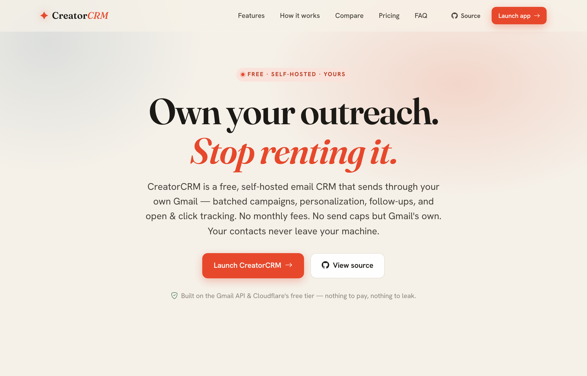
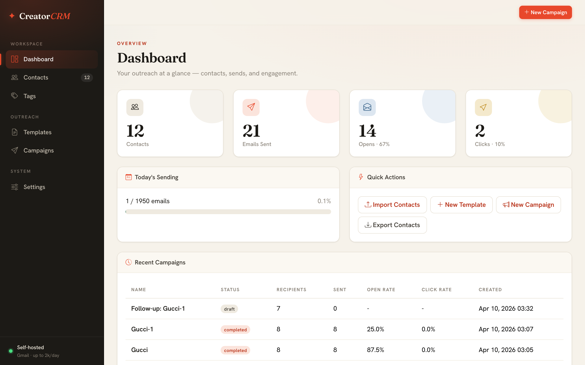
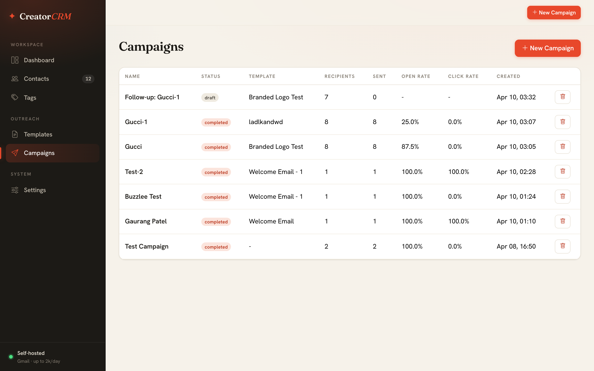
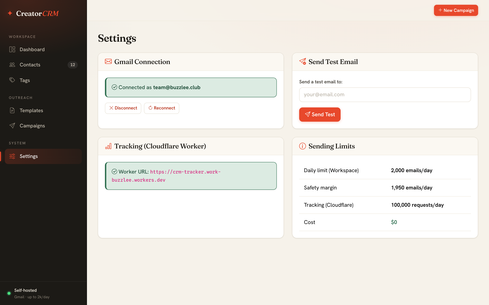
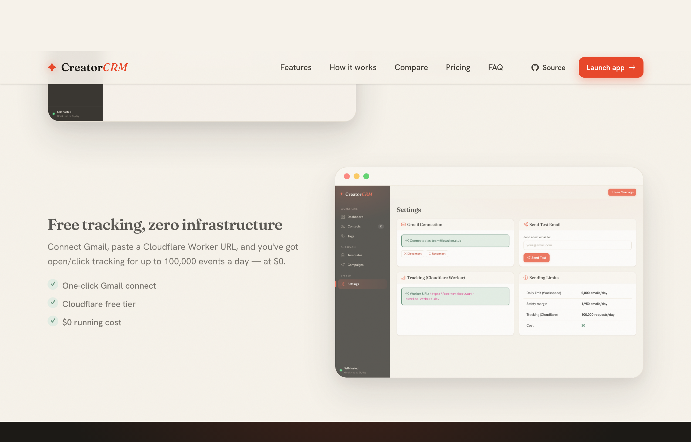

<div align="center">



# ✦ CreatorCRM

### Own your outreach. Stop renting it.

**A free, self-hosted email outreach CRM.** Send up to 2,000 emails/day through your own Gmail — with open &amp; click tracking, batched campaigns, personalization, and follow-ups. No monthly fees. No send caps but Gmail's own. Your contacts never leave your machine.

<br>


<br>

[**🚀 Launch the app**](http://localhost:5050) · [**View the landing page**](http://localhost:5050/landing/) · [**Report an issue**](https://github.com/gsp9145/creator-crm/issues)

</div>

---

## 💡 Why CreatorCRM?

Mail-merge add-ons like YAMM, Mailmeteor, and GMass feel cheap — until you scale. Then come the monthly fees, the artificial send caps, and the quiet truth that **your contact list lives on someone else's servers.**

CreatorCRM does the same job for **$0**: you self-host it, it sends through *your* Gmail, and your data stays in a local SQLite file you own. Tracking runs on Cloudflare's free tier. That's the whole pitch.

> **The same job. None of the rent.**

---

## 📸 Screenshots

| Dashboard | Campaigns |
|:---:|:---:|
|  |  |
| **Settings &amp; tracking** | **Landing page** |
|  |  |

---

## ✨ Features

- **📇 Contact management** — Import from CSV, tag, search, filter, and run bulk actions on thousands of contacts.
- **✏️ Email templates** — HTML editor with live preview, starter templates, and personalization variables (`{first_name}`, `{company}`, …).
- **📨 Campaign management** — Batch sending, pause/resume, tag targeting, exclude previous recipients, and automated follow-ups.
- **📊 Open &amp; click tracking** — Real engagement metrics via a free Cloudflare Worker, polled every minute.
- **📈 Dashboard** — Sent / open / click stats, daily sending progress, and campaign overview at a glance.
- **🕑 Communication history** — Full email history per contact with rendered previews.
- **🎨 Modern UI** — A "Warm Editorial Workspace" design: dark sidebar, Fraunces + Hanken Grotesk type, ember accent.
- **🌐 Marketing landing page** — A polished public page (served at `/landing/`, also standalone-hostable).

---

## ⚖️ How it compares

*As of June 2026 — verify current pricing on each vendor's site.*

| | **CreatorCRM** | YAMM | Mailmeteor | GMass |
|---|:---:|:---:|:---:|:---:|
| **Price** | **$0 — free forever** | $25–50/yr | $13–25/mo | $30–60/mo |
| **Free-tier sends** | Up to Gmail's cap\* | 50/day | 50/day | Limited |
| **Open &amp; click tracking** | ✅ Free | 💲 Paid | 💲 Paid | 💲 Paid |
| **Automated follow-ups** | ✅ | ✅ | ✅ | ✅ |
| **Per-email / SaaS fee** | ❌ None | Recurring | Recurring | Recurring |
| **Self-hostable** | ✅ | ❌ | ❌ | ❌ |
| **Your data stays yours** | ✅ On your machine | ☁️ Their cloud | ☁️ Their cloud | ☁️ Their cloud |

> \* Your real daily limit is set by **Gmail**, not the tool — about **500/day** on a personal account and **2,000/day** on Google Workspace.

---

## 🚀 Quick Start

### 1. Clone &amp; install

```bash
git clone https://github.com/gsp9145/creator-crm.git
cd creator-crm
pip install -r requirements.txt
cp .env.example .env
```

### 2. Set up the Gmail API

1. Go to the [Google Cloud Console](https://console.cloud.google.com)
2. Create a new project
3. Enable the **Gmail API**
4. **APIs &amp; Services → Credentials → Create OAuth Client ID** (Desktop app)
5. Download the JSON and save it as `credentials.json` in this folder

### 3. Configure

Edit `.env` with your sender name and timezone.

### 4. Run

```bash
python app.py
```

Open **http://localhost:5050** → **Settings → Connect Gmail** to authorize.

### 5. (Optional) Set up tracking

Deploy the Cloudflare Worker for open/click tracking:

```bash
npm install -g wrangler
cd cloudflare-worker
wrangler login
wrangler d1 create crm-tracking
# Update database_id in wrangler.toml
wrangler d1 execute crm-tracking --remote --command "CREATE TABLE IF NOT EXISTS events (id INTEGER PRIMARY KEY AUTOINCREMENT, campaign_contact_id INTEGER NOT NULL, event_type TEXT NOT NULL, url TEXT, ip_address TEXT, user_agent TEXT, created_at TEXT DEFAULT (datetime('now')));"
wrangler deploy
```

Copy the Worker URL into `CLOUDFLARE_WORKER_URL` in `.env`.

---

## 🌐 Landing page

A modern marketing landing page lives in [`landing/`](landing/) and positions CreatorCRM as the free, self-hosted challenger to paid mail-merge tools.

- **In the app:** served by Flask at **http://localhost:5050/landing/**
- **Standalone:** `landing/` is self-contained (`index.html` + `landing.css` + `landing.js` + `assets/`), so it can be hosted as static files on **Cloudflare Pages, Netlify, or GitHub Pages**.

---

## 📬 Email deliverability

Before sending campaigns, set up DNS records for your domain:

- **SPF** — TXT record: `v=spf1 include:_spf.google.com ~all`
- **DKIM** — Enable in Google Workspace Admin → Gmail → Authenticate email
- **DMARC** — TXT record: `v=DMARC1; p=none; rua=mailto:dmarc@yourdomain.com`

Start with the warm-up schedule (20 emails/day, increasing weekly).

---

## 🛠 Tech stack

| Layer | Technology |
|---|---|
| **Backend** | Flask + SQLAlchemy + SQLite |
| **Frontend** | Jinja2 + Bootstrap 5, re-skinned with a custom design system (Fraunces / Hanken Grotesk / Spline Sans Mono) |
| **Email** | Gmail API with OAuth2 |
| **Tracking** | Cloudflare Workers + D1 |
| **Scheduling** | APScheduler (in-process) |
| **Cost** | **$0** |

See [`PLAN.md`](PLAN.md) for the full implementation plan, database schema, and design-system reference.

---

## 📁 Project structure

```
crm/
├── app.py                 # Flask app — all routes, entry point
├── models.py              # SQLAlchemy ORM models
├── gmail_service.py       # OAuth2 + send_email()
├── campaign_sender.py     # Batch sending + APScheduler jobs
├── tracking.py            # Tracking pixel + link rewriting
├── csv_importer.py        # CSV upload + column mapping
├── templates/             # Jinja2 templates (dark sidebar layout)
├── static/style.css       # "Warm Editorial Workspace" design system
├── landing/               # Marketing landing page (Flask /landing/ + standalone)
├── docs/                  # README images
└── cloudflare-worker/     # Open/click tracking worker (deployed separately)
```

---

## 🤝 Contributing

Issues and PRs are welcome! This is a small, self-contained Flask app — easy to read, easy to extend.

## 📄 License

[MIT](LICENSE) — free to use, modify, and self-host.

<div align="center">
<br>
<strong>Own your outreach. Get CreatorCRM free.</strong>
</div>
